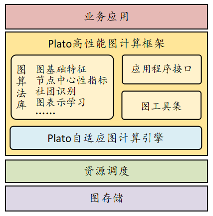
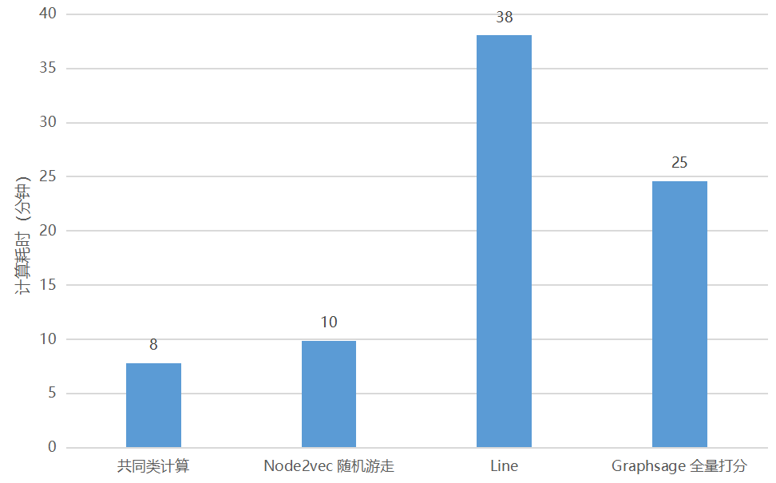

# Tencent Graph Computing (TGraph) Officially Open Sourced High-Performance Graph Computing Framework: Plato

## Introduction

Tencent Graph Computing (TGraph) has officially open sourced its High-Performance Graph Computing Framework: Plato. The release of this industrial-level state-of-the-art distributed graph computing framework marks the era of "minutes graph processing for ultra-large-scale graphs".

## Significance

Graphs, as an efficient method for representing and analyzing big data, has become the vital tool for doing data analysis and mining for social networks, recommender systems, text retrieval, cyber security applications, and bio-medical applications. A few examples include: periodically ranking web pages according to their impact factor to improve users' search experience; doing structural analysis on large-scale social networks to provide accurate recommendation services for users; understanding the interactions between different proteins through subgraph matching to develop more effective clinical medicine.

Graph data is high-dimensional, the performance of graph algorithms is one of the most decisive factor of the success of a graph processing/mining system. For Tencent, who has several billion-node large-scale social networks, performance is extremely important. However, most distributed graph computing frameworks, be them industrial level or academic research projects, cannot meet Tencent's requirement of high-performance. Several fundamental statistical attributes of social networks in Tencent cannot be achieved with constrained computing resource and time.

Tencent Graph Computing (TGraph) has integrated Tencent's internal computing resource, and is committed to build the state-of-the-art ultra-large-scale graph computing platform in the industry. For social networks with billions of nodes, TGraph's own high-performance graph computing framework Plato reduces the computing time from days to minutes, with order-of-magnitude performance increase. This not only achieves the state-of-the-art performance, but also breaks the bottleneck of computing resource: instead of several hundreds servers, Plato can finish its tasks on as little as ten servers. Plato has started serving several core businesses including WeChat internally at Tencent, and has created great business value.

## Overview

Plato High-Performance Graph Computing Framework has the following contributions:
- Plato achieves the state-of-the-art performance. It has 10x to 100x performance boost compared to Spark GraphX. Several graph algorithms that use to take days now takes hours to minutes to finish with Plato.
- Plato consumes 10x to 100x smaller memory compared to Spark GraphX. This enables Tencent-scale ultra-large-scale graph computing on a middle-to-small-scale cluster (10 servers), greatly saves the computing cost.
- TGraph begins with its support for ultra-large-scale social network data, but can be extended to fit other types of data with minimal efforts. Plato's high-performance, flexibility, and plug-in features greatly promote the technical advance in the field of ultra-large-scale graph computing framework.

## Core features

Currently, Plato provides two types of service:

- Offline Graph Computing of Tencent-scale Data;
- Graph Representation Learning on Tencent-scale Data.

Plato framework's architecture overview is shown as below (Legend in Chinese). Plato runs on general x86 clusters such as Kubernetes clusters, Yarn clusters, etc. At the file system layer, Plato provides several interfaces for mainstream file system support. For example HDFS, Ceph, etc.

The core of Plato is its adaptive graph computing engine. Currently, for different graph algorithms, Plato offers sparse-dense adaptive computing mode, shared-memory computing mode, and pipeline-based computing mode. It also has well-designed interface for new computing and communication modes support. Besides, the adaptive graph computing engine also contains graph partitioning, graph representation, and multi-level computing communication cooperative scheduling modules.

On top of our graph computing engine, Plato offers multi-level interfaces for algorithm developers of different businesses: from low-level API, to graph algorithm library, to "solutions" customized for specific business: graph computing toolset. Through these application-level interfaces and tools, Plato can integrate offline computing results with other machine learning algorithms, so as to support a variety of businesses on top.

Open sourced algorithms:

- [x] Graph Attributes
  + [x] Tree Depth/Width
  + [x] Graph Attributes All-in-One: Number of Nodes/Edges, Density, Degree Distribution
  + [x] N-step Degrees
  + [x] HyperANF
- [x] Node Centrality Metrics
  + [x] K-core
  + [x] PageRank
  + [x] Closeness
  + [x] Betweenness
- [x] Connectivity & Community Discovery
  + [x] Connected-Component
  + [x] LPA
  + [x] HANP
- [x] Graph Representation Learning
  + [x] Node2Vec-Randomwalk
  + [x] Metapath-Randomwalk
- [x] Clustering/Unfolding Algorithms
  + [x] Fast Unfolding
- [x] Other Graph Algorithms
  + [x] BFS
  + [x] Mutual X Computing

Algorithms to open source:

- [ ] Network Embedding
  + [ ] LINE
  + [ ] Word2Vec
  + [ ] GraphVite
- [ ] GNN
  + [ ] GCN
  + [ ] GraphSage

## Performance Analysis

**Plato's performance is better than any other mainstream distributed graph computing framework**. The following graph compares Plato and Spark GraphX on two benchmarks: PageRank and LPA. Note that we only show two representative benchmarks, performance comparisons for other graph algorithms show similar pattern with these two. The results show a 10x to 100x performance boost between Spark GraphX and Plato.

Apart from performance, another major factor that limits ultra-large-scale graph computing is huge memory consumption. One of Plato's advantages is its minimal memory consumption. The following graph shows that Plato consumes 10x to 100x smaller memory compared to Spark GraphX, which creates a massive space for algorithmically and engineering innovation with the saved memory.

Plato also has extraordinary performance in algorithms for real-world businesses. Performed on Tencent-scale data, Plato achieves high-performance. The following graph shows Plato's running time (in minutes) for typical internal algorithms such as Mutual X Computing, Node2Vec, LINE, and GraphSAGE, with Tencent-scale data.

